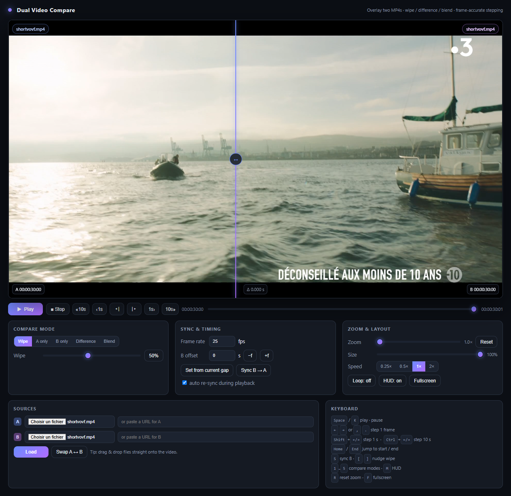
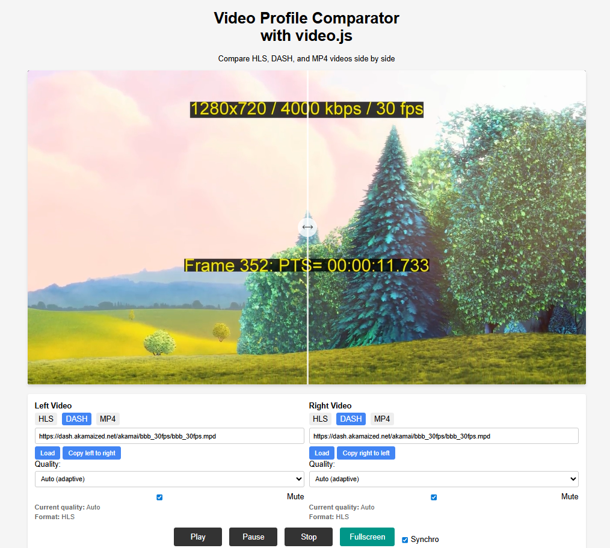
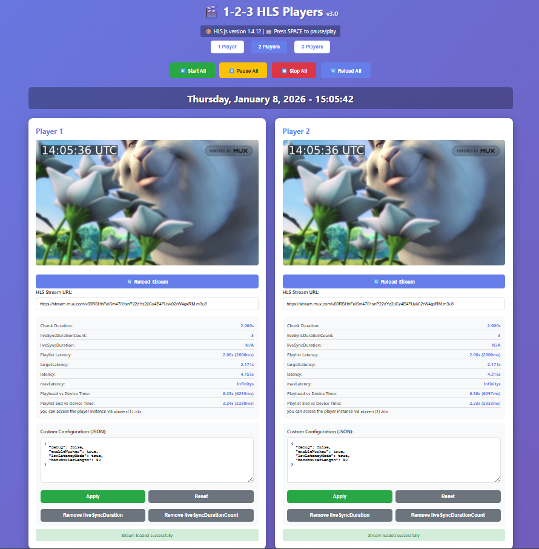

# praDualVideoPlayers

> A small collection of single-file, browser-based video players for comparing encodes and inspecting streaming behaviour.

[](LICENSE)
[](#)
[](https://claude.com/claude-code)

## About

I'm not a developer, but I sometimes need tools to move faster. These players were built with the active help of AI assistants — **[Claude Code](https://claude.com/claude-code)** in particular was used extensively to write, refactor and debug them.

Each tool is a **single, self-contained `.html` file**. There is nothing to build and nothing to install: download the file, open it in a modern browser, and load your videos from a local file or a URL. External libraries (when needed) are pulled from a CDN.

Use them, fork them, improve them, or ignore them.

## Tools

### 1. praMP4SimplestMp4DualVideoPlayer

An "as simple as possible" dual player to quickly compare two videos (typically the same source encoded with different parameters). Both videos share a single timeline so you always compare the same frame.



**Features**

- Load side A and side B from a local file or a pasted URL
- Frame-accurate transport with a shared timeline
- Compare modes: **Wipe**, **A only**, **B only**, **Difference**, **Blend**
- Adjustable wipe position
- Zoom and pan into both videos at once
- On-screen HUD with timing information

**Keyboard shortcuts**

| Key | Action |
| --- | --- |
| `Space` / `K` | Play / pause |
| `←` `→` or `,` `.` | Step 1 frame |
| `Shift` + `←` / `→` | Step 1 second |
| `Ctrl` + `←` / `→` | Step 10 seconds |
| `Home` / `End` | Jump to start / end |
| `S` | Sync B to A |
| `[` `]` | Nudge the wipe line |
| `1` … `5` | Select compare mode |
| `M` | Toggle HUD |
| `R` | Reset zoom |
| `F` | Fullscreen |

### 2. praABRSideBySideDualVideoPlayer

Historically built to compare different encoding configurations, now with adaptive streaming support. Two players sit side by side behind a draggable divider, so you can wipe between them.



**Features**

- Plays **HLS**, **DASH** and **MP4** sources
- Draggable divider to reveal the left or right player
- Per-side quality-level selection (lock a rendition or let ABR run)
- Live readout of the current quality and format per side
- "Copy left to right" / "Copy right to left" to reuse a URL
- Shared Play / Pause / Stop, per-side mute, and fullscreen
- Built on [Video.js](https://videojs.com/) with the HTTP streaming and quality-levels plugins

### 3. pra123HLSPlayer

Historically designed to measure and tune stream and player latency. Spin up **1 to 3** HLS players on the same page, each with its own URL and its own `hls.js` configuration.



**Features**

- 1, 2 or 3 players added dynamically
- Per-player editable `hls.js` config (JSON), including low-latency options
- Latency metrics per player: playlist latency, target latency, current latency, max latency
- In-page reference explaining each metric and the relevant `hls.js` properties
- Built on [hls.js](https://github.com/video-dev/hls.js)

## Getting started

```bash
git clone https://github.com/PhilippeR/praDualVideoPlayers.git
cd praDualVideoPlayers
```

Then open the file you want directly in your browser (double-click, or `File > Open`):

- `praMP4SimplestMp4DualVideoPlayer.html`
- `praABRSideBySideDualVideoPlayer.html`
- `pra123HLSPlayer.html`

For loading remote URLs that enforce CORS, or for local files that the browser blocks under `file://`, serve the folder over HTTP:

```bash
# Python 3
python -m http.server 8000
# then browse to http://localhost:8000/
```

> Local `.mp4` test files are ignored by git (see `.gitignore`).

## Tech stack

- Plain HTML, CSS and vanilla JavaScript — one file per tool, no build step
- [Video.js](https://videojs.com/) + `videojs-http-streaming` + `videojs-contrib-quality-levels` (praABRSideBySideDualVideoPlayer)
- [hls.js](https://github.com/video-dev/hls.js) (pra123HLSPlayer)
- All third-party libraries are loaded from a CDN

## Built with Claude Code

These tools were written and iterated on in close collaboration with AI assistants. **[Claude Code](https://claude.com/claude-code)** was used actively throughout: implementing features, refactoring the keyboard handling, fixing player sizing and fullscreen behaviour, and keeping this README in sync with the code.

## Contributing

Issues and pull requests are welcome. Because each tool is a single file, a focused PR that touches one `.html` file is the easiest to review. Please describe what you changed and how you tested it.

## License

Distributed under the **GNU General Public License v3.0**. See [LICENSE](LICENSE) for details.
